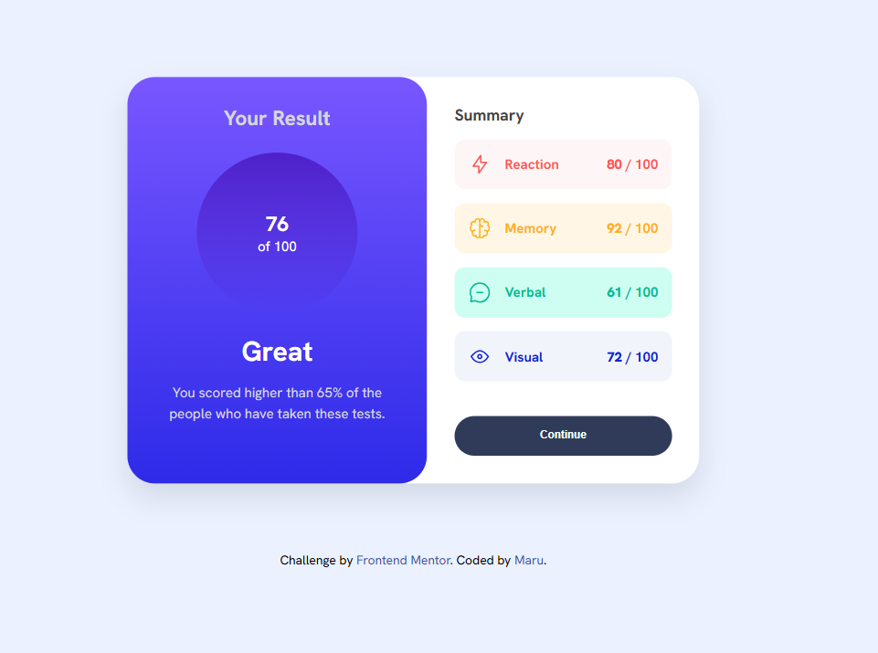
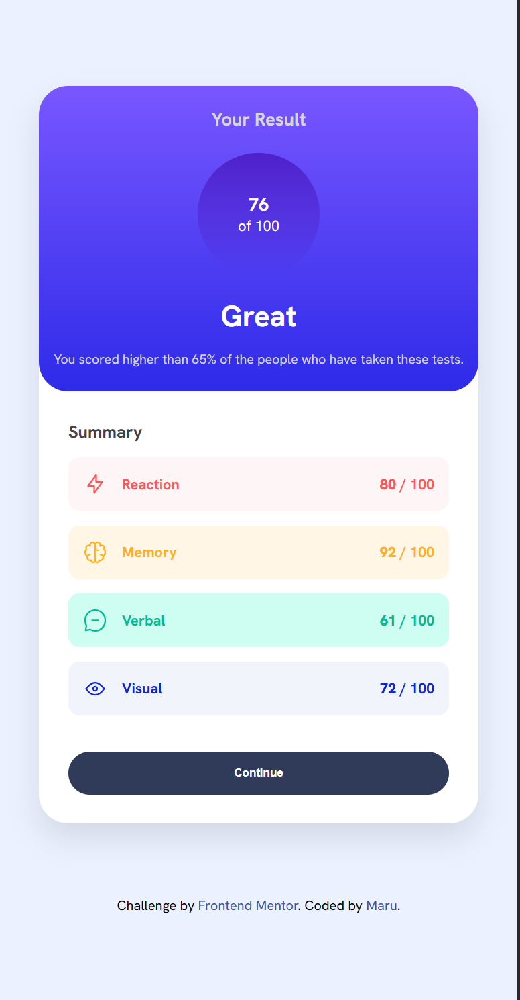

# Frontend Mentor - 要約コンポーネント

これは Frontend Mentor の Summary Component Main です。Frontend Mentor は、現実的なプロジェクトを通してコーディングスキルを向上させるのに役立ちます。

## 概要

### 課題内容

ユーザーは以下のことができるようにすることが目標です：

デバイスの画面サイズに応じて、最適なレイアウトでサイトを閲覧できること

### スクリーンショット

### リンク

- Solution URL: [Add solution URL here](https://summary-component-theta-eight.vercel.app/)

## 制作プロセス

### 使用技術

- セマンティックな HTML5 マークアップ
- CSS カスタムプロパティ
- Flexbox

## 制作者

- Frontend Mentor - [@zerowater](https://www.frontendmentor.io/profile/zerowater4704)
- Twitter - [@jnyngxi188584](https://www.x.com/jnyngxi188584)
